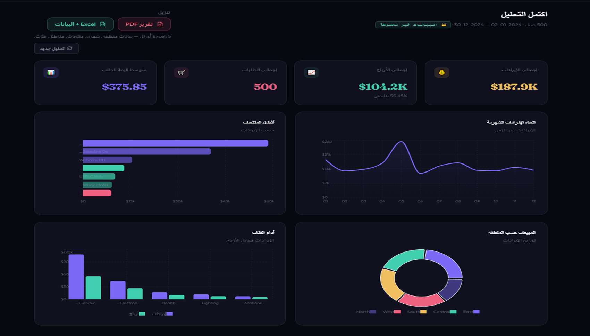

# InsightDrop — Instant Sales Analytics SaaS

> **Upload. Analyze. Done.** Your data is never stored.

InsightDrop is a production-ready micro-SaaS that turns any CSV or Excel sales export into a
beautiful, interactive analytics dashboard — in under 10 seconds. No data warehouse. No setup.
No trust issues. Every file is processed in-memory and discarded immediately.

---




## Live Demo

| Layer | URL |
|-------|-----|
| Frontend | `https://your-app.vercel.app` |
| API Docs | `https://your-api.onrender.com/docs` |

---

## Why InsightDrop?

| Traditional BI tool | InsightDrop |
|---------------------|-------------|
| Days of setup | Ready in minutes |
| Data stored on vendor servers | Zero data retention |
| $100–$500/month | Free to start |
| Requires data engineering | Just upload a file |
| GDPR complexity | Private by design |

---

## Features

- **Instant KPIs** — Revenue, Profit, Orders, Average Order Value, Profit Margin
- **4 interactive charts** — Monthly trend, Top products, Region distribution, Category performance
- **Zero persistence** — Files processed in RAM, deleted immediately after response
- **Supabase Auth** — Email/password + Google OAuth, JWT-secured API
- **50 MB file support** — CSV and Excel (`.xlsx`, `.xls`)
- **Smart column mapping** — Common header aliases auto-detected
- **Mobile responsive** — Clean SaaS UI on any screen size
- **Free-tier deployable** — Vercel + Render + Supabase, $0/month to launch

---

## Tech Stack

```
Frontend    Next.js 14 (App Router) + TailwindCSS + Recharts
Backend     FastAPI (Python 3.11) + pandas
Auth        Supabase Auth (JWT)
Hosting     Vercel (frontend) + Render (backend)
```

---

## Quick Start

### Prerequisites
- Node.js 18+
- Python 3.11+
- Supabase account (free)

### 1. Clone

```bash
git clone https://github.com/yourname/insightdrop.git
cd insightdrop
```

### 2. Backend

```bash
cd backend
#python -m venv venv && source venv/bin/activate   # Windows: venv\Scripts\activate
python -m venv venv && .\venv\Scripts\Activate.ps1  # Windows: venv\Scripts\activate
pip install -r requirements.txt
cp .env.example .env
# Edit .env with your Supabase JWT secret
uvicorn main:app --reload
# → http://localhost:8000/docs
```

### 3. Frontend

```bash
cd frontend
npm install
cp .env.local.example .env.local
# Edit .env.local with your Supabase + API URLs
npm run dev
# → http://localhost:3000
```

---

## Required CSV/Excel Schema

Your file must include these columns (order and case don't matter):

| Column | Description |
|--------|-------------|
| `order_id` | Unique order identifier |
| `product_name` | Product name |
| `category` | Product category |
| `quantity` | Units sold (numeric) |
| `price` | Unit price (numeric) |
| `cost` | Unit cost (numeric) |
| `order_date` | Date of order (any format) |
| `region` | Sales region |

**Common aliases are auto-mapped:** `qty`, `unit_price`, `date`, `sale_date`, `product`, etc.

### Sample CSV

```csv
order_id,product_name,category,quantity,price,cost,order_date,region
ORD-001,Wireless Mouse,Electronics,3,29.99,12.00,2024-01-15,North
ORD-002,Standing Desk,Furniture,1,349.00,180.00,2024-01-18,East
ORD-003,USB-C Hub,Electronics,5,39.99,15.00,2024-02-02,West
```

---

## API Reference

### `POST /analyze/`

Accepts a multipart file upload. Returns analytics JSON.

**Headers:**
```
Authorization: Bearer <supabase_access_token>
Content-Type: multipart/form-data
```

**Body:**
```
file: <CSV or Excel file>
```

**Response `200 OK`:**
```json
{
  "kpis": {
    "total_revenue": 125430.50,
    "total_profit": 48200.20,
    "total_orders": 1842,
    "avg_order_value": 68.10,
    "profit_margin_pct": 38.43
  },
  "charts": {
    "monthly_sales": [
      { "month": "2024-01", "revenue": 18200.00, "orders": 241 }
    ],
    "top_products": [
      { "product": "Wireless Mouse", "revenue": 12400.00, "quantity": 413 }
    ],
    "region_sales": [
      { "region": "North", "revenue": 42300.00, "orders": 612 }
    ],
    "category_sales": [
      { "category": "Electronics", "revenue": 68000.00, "profit": 28000.00, "orders": 920 }
    ]
  },
  "meta": {
    "rows_processed": 1842,
    "date_range": { "start": "2024-01-01", "end": "2024-12-31" }
  }
}
```

**Error responses:**
| Code | Meaning |
|------|---------|
| 401 | Invalid/expired JWT |
| 413 | File exceeds 50 MB |
| 415 | Unsupported file type |
| 422 | Missing required columns |
| 500 | Internal processing error |

---

## Deployment

See [docs/deployment.md](docs/deployment.md) for the full step-by-step guide.

**TL;DR:**
1. Supabase → create project → copy JWT secret
2. Render → deploy `backend/` → set env vars
3. Vercel → deploy `frontend/` → set env vars
4. Update CORS allowlist in `backend/main.py`

---

## Project Structure

```
insightdrop/
├── backend/
│   ├── main.py                 # FastAPI app entry point
│   ├── routers/
│   │   ├── analyze.py          # POST /analyze – auth + ETL
│   │   └── health.py           # GET /health/
│   ├── etl/
│   │   └── pipeline.py         # 6-stage in-memory ETL
│   ├── services/
│   │   └── auth.py             # Supabase JWT verification
│   ├── utils/
│   │   └── validators.py       # File type + size validation
│   ├── requirements.txt
│   ├── render.yaml             # Render deploy config
│   └── .env.example
│
├── frontend/
│   ├── app/
│   │   ├── layout.tsx          # Root layout + fonts
│   │   ├── globals.css         # Design system + Tailwind
│   │   ├── page.tsx            # Landing page
│   │   ├── login/page.tsx      # Auth (email + Google OAuth)
│   │   └── dashboard/page.tsx  # Main analytics dashboard
│   ├── components/
│   │   ├── FileUploadZone.tsx  # Drag-and-drop file input
│   │   ├── KpiCard.tsx         # KPI metric card
│   │   ├── ui/Skeleton.tsx     # Loading skeleton
│   │   └── charts/
│   │       ├── MonthlySalesChart.tsx
│   │       ├── TopProductsChart.tsx
│   │       ├── RegionSalesChart.tsx
│   │       └── CategoryChart.tsx
│   ├── lib/
│   │   ├── supabase.ts         # Supabase browser client
│   │   ├── api.ts              # analyzeFile() + types
│   │   └── utils.ts            # cn(), formatCurrency()
│   ├── package.json
│   ├── tailwind.config.js
│   └── .env.local.example
│
├── docs/
│   ├── architecture.md
│   └── deployment.md
│
└── README.md
```

---

## Monetization Ideas

- **Freemium** — Free tier: 5 analyses/month. Pro: unlimited ($9/mo)
- **Per-analysis** — $0.99 per file processed (Stripe one-click)
- **Team plan** — Shared workspace + history export ($29/mo)
- **White-label** — License the engine to agencies ($199/mo)

---

## Roadmap

- [ ] PDF report export (one-click download)
- [ ] Scheduled email reports
- [ ] Multiple file comparison
- [ ] AI-generated insights (anomaly detection)
- [ ] Stripe billing integration
- [ ] Team workspaces

---

## License

MIT — free to use, modify, and sell.

---

*Built with FastAPI, Next.js, pandas, Recharts, and Supabase Auth.*
*Zero data stored. Ever.*
